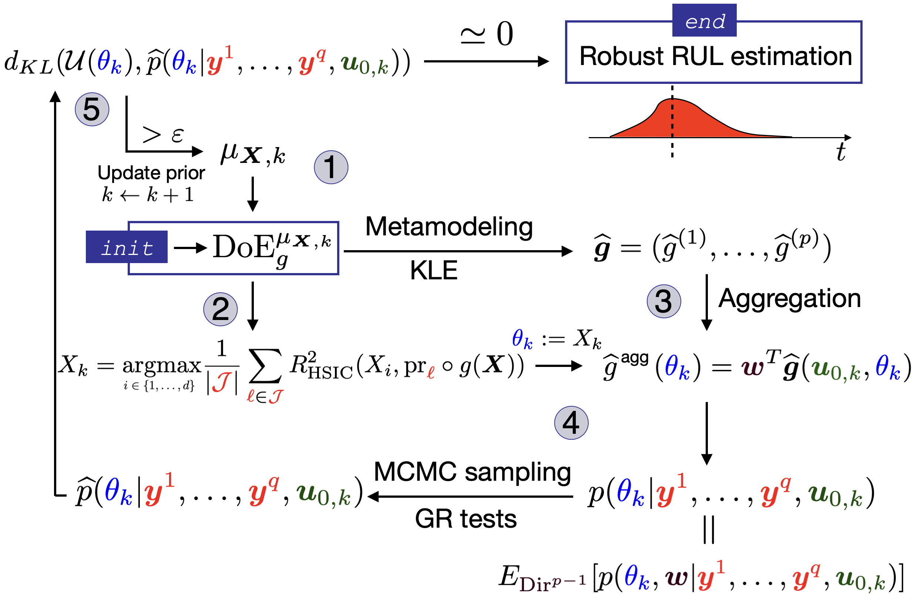

# Introduction

This is the reproducible code for the paper *Offline assimilation of Multifidelity Data for Robust Degradation Prognostics*, preprint available here...

To cite this work please use the following BibTeX entry:
```
@misc{jaber2025,
  author  = {Jaber, E. and Chabridon, V. and Remy, E. and Mougeot, M. and Lucor, D. and Keller, M. and Pelamatti, J. and Baudin, M.},
  title   = {{Offline assimilation of Multifidelity Data for Robust Degradation Prognostics}},
  arxiv = {},
  year  = {2025}
}
```
This article proposes a methodology for assimilating sparse and multifidelity degradation data into a simulation model. It relies on kernel sensitivity analysis HSIC-based indices as well as a specific Bayesian likelihood using different priors for the noise. It then makes use of RWMH-MCMC for sampling in this tailored posterior distribution. 
If the degradation simulation model is expensive to evaluate, we rely on Karhunèn-Loève-based time-varying surrogate models and the methodology can also integrate multiple equally valid surrogates to overcome possible surrogate bias. Robust prediction of probabilistic remaining useful life for the asset under consideration can then be made.



# Requirements

Create the following conda environment:
```
conda create environment.yml
```
The essential Python library used for the different scripts is the UQ library: [OpenTURNS 1.24](https://github.com/openturns/openturns?tab=GPL-3.0-2-ov-file#).


# The scripts
- [metamodels.py](metamodels.py): implements scalar Gaussian process metamodels , non-intrusive vector polynomial chaos expansions as well as Karhunèn-Loève field metamodels. All classes come with the scikit-learn methods ```.fit()``` and ```.predict()``` syntax 
- [hsic.py](hsic.py): Python class to for computing HSIC indices (regular, target and conditional)
- [mcmc.py](mcmc.py): Python class implementing the RWMH-MCMC sampling of the posterior distribution as explained in the article

We run our methodology on two cases:
-    The Paris' law which is an ODE-based degradation model of crack propagation. We run the methodology on a fictitious material with an explicit Euler implementation of the model, available in [this notebook](methodology_crack_growth.ipynb)
- The THYC-Puffer-DEPO clogging simulator for steam generators in pressurized-water-reactors. To protect the industrial secrecy, the ```DATA``` folder is encrypted (see end of README), one run available in [this notebook](methodology_clogging.ipynb)


# License
This repository is issued under the same licenses as [OpenTURNS](https://github.com/openturns/openturns?tab=GPL-3.0-2-ov-file#), namely LGPL-3.0 license.


To request the clogging data, write to
```
{surname}.{lastname}@edf.fr
```
where 
```surname = vincent, emmanuel, merlin, julien, michael``` 
 & ```lastname = chabridon, remy, keller, pelamatti, baudin```